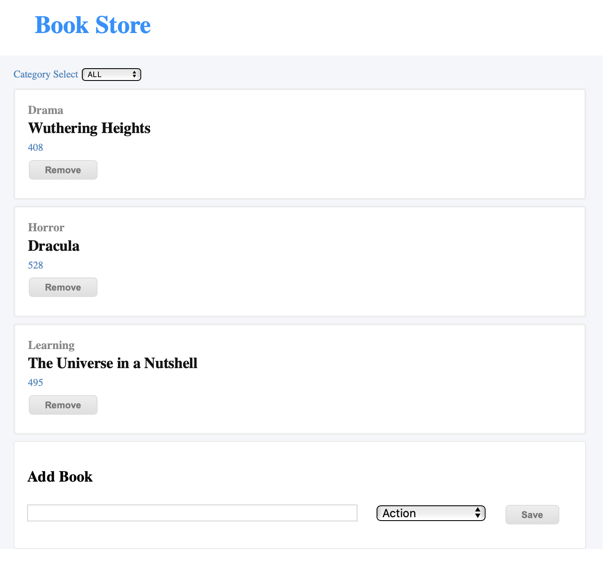

# bookstore-cms

> This is a basic Bookstore CMS app built with HTML, CSS, JS, React and Redux. Based on this [project guidelines](https://github.com/microverseinc/project-redux-bookstore/blob/master/README.md). The main purpose is to develop and deploy a functional React + Redux CMS app.

## Built With
- Node.js
- React
- React-DOM
- React-Create-App
- Redux
- npm
- CSS
- ES6
- HTML

## Getting Started

To get a local copy up and running follow these simple example steps. You can skip the next 3 steps if you choose the live page.

### Prerequisites
  A text editor of your choice and Internet connection.
  
### Setup
  Clone the repository on your local or cloud machine.
  
### Install
  Run `npm i` on your terminal to install the required dependencies;
  Then run `npm run server` to launch the local server. It will open on your main browser.
  
  Or 

  `yarn install` for install all depences
  `yarn start` for runner the server
